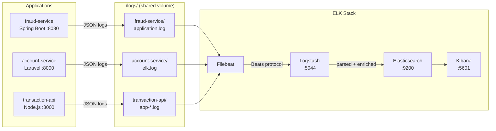

# ELK Stack: Multi-Application Centralized Logging


Production-ready centralized logging with **Elasticsearch, Logstash, Kibana, and Filebeat** across heterogeneous application environments (Spring Boot, Laravel, Node.js).

> Companion repository for the article: [ELK Stack: Centralized Logging Across Multiple Production Applications](https://medium.com/@belemgnegreetienne)

---

## Architecture



Call chain: transaction-api → fraud-service (score) → account-service (debit/credit). A single POST /transfer generates correlated log entries across all three services and tech stacks.

File-based logging (apps write to disk, Filebeat ships) over direct TCP shipping for resilience: if Logstash goes down, apps keep running and Filebeat buffers until it recovers.

---

## Quick Start

### Prerequisites

- Docker + Docker Compose
- 4GB RAM minimum for ELK stack
- Ports 9200, 5601, 5044 available

### 1. Clone and configure

```bash
git clone https://github.com/EtienneBel/elk-centralized-logging.git
cd elk-centralized-logging
cp .env.example .env
# Edit .env and set a strong ELASTIC_PASSWORD
```

### 2. Create the shared Docker network

```bash
docker network create logging-network
```

### 3. Create log directories

```bash
mkdir -p logs/fraud-service logs/account-service logs/transaction-api
```

### 4. Start the ELK stack

```bash
docker compose -f docker-compose.elk.yml up -d
```

### 5. Start the demo apps (optional)

```bash
docker compose -f docker-compose.apps.yml up -d
```

### 6. Verify

```bash
# Check all containers are running
docker ps

# Verify Elasticsearch health (status should be "green" or "yellow")
curl -u elastic:your_password 'http://localhost:9200/_cluster/health?pretty'

# Hit each app health endpoint
curl http://localhost:8080/health   # fraud-service (Spring Boot)
curl http://localhost:8000/health   # account-service (Laravel)
curl http://localhost:3000/health   # transaction-api (Node.js)

# Access Kibana
open http://localhost:5601
```

---

## Stack Components

### ELK

| Component | Version | Port | Role |
|---|---|---|---|
| Elasticsearch | 8.11.1 | 9200 | Storage + search |
| Logstash | 8.11.1 | 5044 | Parse + route |
| Kibana | 8.11.1 | 5601 | Visualize |
| Filebeat | 8.11.1 | — | Ship log files |

### Demo Applications

| Service | Stack | Port | Compose file |
|---|---|---|---|
| transaction-api | Node.js 20 / Express   | 3000 | docker-compose.apps.yml |
| fraud-service   | Spring Boot 3.2        | 8080 | docker-compose.apps.yml |
| account-service | Laravel 12 / PHP 8.3   | 8000 | docker-compose.apps.yml |

---

## Demo Scenarios

### Seeded accounts (reset on container restart)

| Account | Owner | Balance | Notes |
|---|---|---|---|
| ACC001 | Alice | 5 000.00 | Normal |
| ACC002 | Bob | 3 000.00 | Normal |
| ACC003 | Charlie | 1 500.00 | Normal |
| ACC004 | Eve | 150.00 | Low balance — any transfer > 150 fails |
| ACC_BLOCKED | — | — | Blacklisted — always blocked by fraud-service |
| ACC999 | — | — | Does not exist — triggers 404 |

### API reference

**transaction-api** — all demo traffic goes here

| Method | Path | Body | Description |
|---|---|---|---|
| POST | `/transfer` | `{ "from", "to", "amount" }` | Initiate a money transfer |
| GET | `/health` | — | Health check |

**fraud-service** — called internally by transaction-api

| Method | Path | Body | Description |
|---|---|---|---|
| POST | `/check` | `{ "accountId", "amount" }` | Score a transaction |
| GET | `/health` | — | Health check |

**account-service** — called internally by transaction-api

| Method | Path | Body | Description |
|---|---|---|---|
| POST | `/execute` | `{ "from", "to", "amount" }` | Debit sender, credit receiver |
| GET | `/account/{id}` | — | Get account info + balance |
| GET | `/health` | — | Health check |

### Scenario 1 — Normal transfer

```bash
curl -s -X POST http://localhost:3000/transfer \
  -H "Content-Type: application/json" \
  -d '{"from":"ACC001","to":"ACC002","amount":100}' | jq
```

Expected response `200`:
```json
{ "success": true, "correlationId": "<id>", "fromBalance": 4900.0, "toBalance": 3100.0 }
```

Kibana — search `correlationId: "<id>"` → 3 INFO entries, one per service.

### Scenario 2 — Large amount (flagged, not blocked)

```bash
curl -s -X POST http://localhost:3000/transfer \
  -H "Content-Type: application/json" \
  -d '{"from":"ACC001","to":"ACC002","amount":15000}' | jq
```

Expected response `200`:
```json
{ "success": true, "correlationId": "<id>", "fromBalance": ..., "toBalance": ... }
```

Kibana — `correlationId: "<id>"` → WARN in fraud-service (`Large amount flagged`) + WARN in transaction-api.

### Scenario 3 — Velocity attack (3 requests within 60 s)

```bash
for i in 1 2 3; do
  curl -s -X POST http://localhost:3000/transfer \
    -H "Content-Type: application/json" \
    -d '{"from":"ACC003","to":"ACC001","amount":10}' | jq .
done
```

Expected: first two `200`, third `403`:
```json
{ "error": "Transfer blocked", "reason": "Velocity attack detected", "correlationId": "<id>" }
```

Kibana — `message: "Velocity attack" and application: "fraud-service"` → ERROR on the third call.

### Scenario 4 — Insufficient funds

```bash
curl -s -X POST http://localhost:3000/transfer \
  -H "Content-Type: application/json" \
  -d '{"from":"ACC004","to":"ACC001","amount":500}' | jq
```

Expected response `402`:
```json
{ "error": "Insufficient funds", "correlationId": "<id>" }
```

Kibana — `correlationId: "<id>"` → ERROR in account-service + ERROR in transaction-api.

### Scenario 5 — Blacklisted account

```bash
curl -s -X POST http://localhost:3000/transfer \
  -H "Content-Type: application/json" \
  -d '{"from":"ACC_BLOCKED","to":"ACC001","amount":50}' | jq
```

Expected response `403`:
```json
{ "error": "Transfer blocked", "reason": "Blacklisted account", "correlationId": "<id>" }
```

Kibana — `correlationId: "<id>"` → ERROR in fraud-service (`Blacklisted account`) + ERROR in transaction-api. account-service is never called.

### Scenario 6 — Unknown account

```bash
curl -s -X POST http://localhost:3000/transfer \
  -H "Content-Type: application/json" \
  -d '{"from":"ACC999","to":"ACC001","amount":50}' | jq
```

Expected response `404`:
```json
{ "error": "Account not found", "correlationId": "<id>" }
```

Kibana — `correlationId: "<id>"` → ERROR in account-service + ERROR in transaction-api.

---

## Application Integration

### Spring Boot

See `apps/fraud-service/` for a working example. Key files:

- `src/main/resources/logback-spring.xml` — JSON structured logging via Logback
- `src/main/java/.../filter/MdcLoggingFilter.java` — correlation ID propagation via MDC

Requires `logstash-logback-encoder` in `pom.xml`:

```xml
<dependency>
    <groupId>net.logstash.logback</groupId>
    <artifactId>logstash-logback-encoder</artifactId>
    <version>7.4</version>
</dependency>
```

Logs are written to `/app/logs/application.log` in JSON format, picked up by Filebeat.

### Laravel

In `config/logging.php`, add a custom channel using `ElkFormatter`:

```php
'elk' => [
    'driver'    => 'single',
    'path'      => storage_path('logs/elk.log'),
    'formatter' => \App\Logging\ElkFormatter::class,
    'level'     => 'debug',
],
```

Copy `apps/account-service/app/Logging/ElkFormatter.php` to your project. Set the log channel:

```bash
LOG_CHANNEL=elk
```

Logs will be written to `storage/logs/elk.log` in JSON format, picked up by Filebeat.

### Node.js

See `apps/transaction-api/` for a working example. Key files:

- `src/logger.js` — Winston JSON logger with daily log rotation
- `src/middleware/requestLogger.js` — correlation ID injection and slow request detection

Requires:

```bash
npm install winston winston-daily-rotate-file uuid
```

Set environment variables:

```bash
APP_NAME=your-service-name
NODE_ENV=production
LOG_DIR=/app/logs
```

---

## Index Lifecycle Management (ILM)

Set up automatic index retention before your disk fills up:

```bash
curl -u elastic:your_password -X PUT \
  'http://localhost:9200/_ilm/policy/logs-policy' \
  -H 'Content-Type: application/json' -d '{
  "policy": {
    "phases": {
      "hot":    { "min_age": "0ms",  "actions": { "rollover": { "max_size": "50gb", "max_age": "1d" } } },
      "warm":   { "min_age": "3d",   "actions": { "shrink": { "number_of_shards": 1 } } },
      "delete": { "min_age": "30d",  "actions": { "delete": {} } }
    }
  }
}'
```

---

## Kibana: Setup & Queries

### 1. Create a data view

1. Open [http://localhost:5601](http://localhost:5601) and log in (`elastic` / your password)
2. Go to **Stack Management → Kibana → Data Views**
3. Click **Create data view**
4. Set **Index pattern** to `*-logs-*` (matches all three service indices)
5. Set **Timestamp field** to `@timestamp`
6. Click **Save data view to Kibana**

> Indices are created the first time a service writes a log. If the data view shows 0 fields, trigger a request first (`curl http://localhost:3000/health`), then refresh.

### 2. Open Discover

1. Go to **Discover** (left sidebar)
2. Select the `*-logs-*` data view in the top-left dropdown
3. Set the time range to **Last 15 minutes** (top-right)
4. Paste any KQL query below into the search bar and press Enter

### 3. Useful KQL queries

```
# Trace a full money transfer across all 3 services
correlationId: "a3f8c21b"

# All blocked transactions (fraud or insufficient funds)
level_name: "ERROR" and application: "transaction-api"

# Velocity attacks detected in the last hour
message: "Velocity attack" and @timestamp > now-1h

# Large amounts flagged by fraud-service
level_name: "WARN" and application: "fraud-service"

# Low balance warnings from account-service
level_name: "WARN" and application: "account-service"

# All errors across the entire system
level_name: "ERROR" and @timestamp > now-1h
```

---

## Key Production Lessons

1. **Check `unknown-logs-*` weekly** — logs appearing there mean a service is misconfigured
2. **Set ILM policy on day one** — not after your disk is full

---

## Project Structure

```
elk-centralized-logging/
├── docker-compose.elk.yml          # ELK stack (Elasticsearch, Logstash, Kibana, Filebeat)
├── docker-compose.apps.yml         # Demo applications
├── .env.example                    # Environment variables template
├── logs/                           # Shared log volume (mounted by apps + Filebeat)
│   ├── fraud-service/
│   ├── account-service/
│   └── transaction-api/
├── logstash/
│   ├── config/logstash.yml
│   └── pipeline/beats-input.conf   # Multi-app routing logic
├── filebeat/
│   └── config/filebeat.yml         # Multi-app input config
├── apps/
│   ├── transaction-api/    # Node.js — receives transfers, orchestrates the flow
│   ├── fraud-service/      # Spring Boot — scores transactions, detects velocity attacks
│   └── account-service/    # Laravel — holds balances, executes debit/credit
└── docs/
    ├── elk-architecture.excalidraw
    └── elk-ilm-lifecycle.mmd
```

---

## Author

**Wend-Kuuni Etienne BELEMGNEGRE**
Lead Dev & DevOps | GCP Certified | GDG Ouagadougou

- Medium: [@belemgnegreetienne](https://medium.com/@belemgnegreetienne)
- LinkedIn: [etienne-belemgnegre](https://linkedin.com/in/etienne-belemgnegre)
- GitHub: [EtienneBel](https://github.com/EtienneBel)

---

## License

MIT
