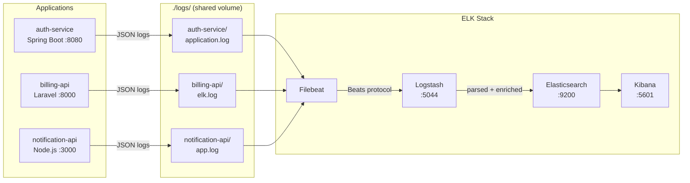

# ELK Stack: Multi-Application Centralized Logging


Production-ready centralized logging with **Elasticsearch, Logstash, Kibana, and Filebeat** across heterogeneous application environments (Spring Boot, Laravel, Node.js).

> Companion repository for the article: [ELK Stack: Centralized Logging Across Multiple Production Applications](https://medium.com/@belemgnegreetienne)

---

## Architecture



File-based logging (apps write to disk, Filebeat ships) over direct TCP shipping for resilience: if Logstash goes down, apps keep running and Filebeat buffers until it recovers.

---

## Quick Start

### Prerequisites

- Docker + Docker Compose
- 4GB RAM minimum for ELK stack
- Ports 9200, 5601, 5044 available

### 1. Clone and configure

```bash
git clone https://github.com/EtienneBel/elk-centralized-logging.git
cd elk-centralized-logging
cp .env.example .env
# Edit .env and set a strong ELASTIC_PASSWORD
```

### 2. Create the shared Docker network

```bash
docker network create logging-network
```

### 4. Create log directories

```bash
mkdir -p logs/auth-service logs/billing-api logs/notification-api
```

### 5. Start the ELK stack

```bash
docker compose -f docker-compose.elk.yml up -d
```

### 6. Start the demo apps (optional)

```bash
docker compose -f docker-compose.apps.yml up -d
```

### 7. Verify

```bash
# Check all containers are running
docker ps

# Verify Elasticsearch health (status should be "green" or "yellow")
curl -u elastic:your_password 'http://localhost:9200/_cluster/health?pretty'

# Hit each app health endpoint
curl http://localhost:8080/health   # auth-service (Spring Boot)
curl http://localhost:8000/health   # billing-api (Laravel)
curl http://localhost:3000/health   # notification-api (Node.js)

# Access Kibana
open http://localhost:5601
```

---

## Stack Components

### ELK

| Component | Version | Port | Role |
|---|---|---|---|
| Elasticsearch | 8.11.1 | 9200 | Storage + search |
| Logstash | 8.11.1 | 5044 | Parse + route |
| Kibana | 8.11.1 | 5601 | Visualize |
| Filebeat | 8.11.1 | — | Ship log files |

### Demo Applications

| Service | Stack | Port | Compose file |
|---|---|---|---|
| auth-service | Spring Boot 3.2 | 8080 | docker-compose.apps.yml |
| billing-api | Laravel 10 / PHP 8.3 | 8000 | docker-compose.apps.yml |
| notification-api | Node.js 20 / Express | 3000 | docker-compose.apps.yml |

---

## Application Integration

### Spring Boot

See `apps/auth-service/` for a working example. Key files:

- `src/main/resources/logback-spring.xml` — JSON structured logging via Logback
- `src/main/java/.../filter/MdcLoggingFilter.java` — correlation ID propagation via MDC

Requires `logstash-logback-encoder` in `pom.xml`:

```xml
<dependency>
    <groupId>net.logstash.logback</groupId>
    <artifactId>logstash-logback-encoder</artifactId>
    <version>7.4</version>
</dependency>
```

Logs are written to `/app/logs/application.log` in JSON format, picked up by Filebeat.

### Laravel

In `config/logging.php`, add a custom channel using `ElkFormatter`:

```php
'elk' => [
    'driver'    => 'single',
    'path'      => storage_path('logs/elk.log'),
    'formatter' => \App\Logging\ElkFormatter::class,
    'level'     => 'debug',
],
```

Copy `apps/billing-api/app/Logging/ElkFormatter.php` to your project. Set the log channel:

```bash
LOG_CHANNEL=elk
```

Logs will be written to `storage/logs/elk.log` in JSON format, picked up by Filebeat.

### Node.js

See `apps/notification-api/` for a working example. Key files:

- `src/logger.js` — Winston JSON logger with daily log rotation
- `src/middleware/requestLogger.js` — correlation ID injection and slow request detection

Requires:

```bash
npm install winston winston-daily-rotate-file uuid
```

Set environment variables:

```bash
APP_NAME=your-service-name
NODE_ENV=production
LOG_DIR=/app/logs
```

---

## Index Lifecycle Management (ILM)

Set up automatic index retention before your disk fills up:

```bash
curl -u elastic:your_password -X PUT \
  'http://localhost:9200/_ilm/policy/logs-policy' \
  -H 'Content-Type: application/json' -d '{
  "policy": {
    "phases": {
      "hot":    { "min_age": "0ms",  "actions": { "rollover": { "max_size": "50gb", "max_age": "1d" } } },
      "warm":   { "min_age": "3d",   "actions": { "shrink": { "number_of_shards": 1 } } },
      "delete": { "min_age": "30d",  "actions": { "delete": {} } }
    }
  }
}'
```

---

## Kibana: Useful KQL Queries

```
# All errors in the last hour
level_name: "ERROR" and @timestamp > now-1h

# Trace a request across ALL services
correlationId: "a3f8c21b"

# Slow requests above 2 seconds
duration_ms > 2000 and level_name: "WARN"

# Specific service errors only
application: "billing-api" and level_name: "ERROR"

# Exclude framework noise
level_name: "ERROR" and not logger: "org.springframework*"
```

---

## Key Production Lessons

1. **Check `unknown-logs-*` weekly** — logs appearing there mean a service is misconfigured
2. **Set ILM policy on day one** — not after your disk is full

---

## Project Structure

```
elk-centralized-logging/
├── docker-compose.elk.yml          # ELK stack (Elasticsearch, Logstash, Kibana, Filebeat)
├── docker-compose.apps.yml         # Demo applications
├── .env.example                    # Environment variables template
├── logs/                           # Shared log volume (mounted by apps + Filebeat)
│   ├── auth-service/
│   ├── billing-api/
│   └── notification-api/
├── logstash/
│   ├── config/logstash.yml
│   └── pipeline/beats-input.conf   # Multi-app routing logic
├── filebeat/
│   └── config/filebeat.yml         # Multi-app input config
├── apps/
│   ├── auth-service/               # Spring Boot — validates users, calls billing-api
│   ├── billing-api/                # Laravel — subscription status
│   └── notification-api/           # Node.js — sends notifications via auth-service
└── docs/
    ├── elk-architecture.excalidraw
    └── elk-ilm-lifecycle.mmd
```

---

## Author

**Wend-Kuuni Etienne BELEMGNEGRE**
Lead Dev & DevOps | GCP Certified | GDG Ouagadougou

- Medium: [@belemgnegreetienne](https://medium.com/@belemgnegreetienne)
- LinkedIn: [etienne-belemgnegre](https://linkedin.com/in/etienne-belemgnegre)
- GitHub: [EtienneBel](https://github.com/EtienneBel)

---

## License

MIT
